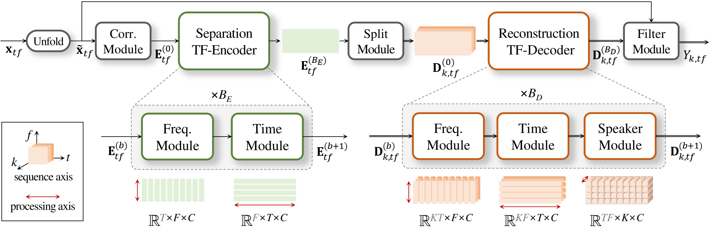

# SR-CorrNet for Speech Separation

Asymmetric Encoder–Decoder based on Time-Frequency Correlation for Speech Separation (SS).
*Paper: [arXiv:2603.29097](https://arxiv.org/abs/2603.29097)*

## Overview

SR-CorrNet is an **asymmetric encoder–decoder** with the **Separation-Reconstruction (SepRe)** strategy on a TF dual-path backbone: the encoder performs coarse separation, the weight-shared decoder progressively reconstructs speaker-discriminative features, and an **attractor-based dynamic split** adapts the output stream count to the speaker configuration. Separation itself is formulated as a **correlation-to-filter** problem — spatio-spectro-temporal correlations in, deep filters out.

This repository provides the Speech Separation (SS) variant for single- and multi-channel inputs, validated on WSJ0-2/3/4/5Mix, WHAMR!, and LibriCSS.

<p align="center">
  
</p>

## Installation

**Requirements**: Python 3.10+

### Library users (pip)

For using SR-CorrNet-SS as a library in your own project. Requires PyTorch pre-installed in your environment.

```bash
# From local source
git clone https://github.com/dmlguq456/SR_CorrNet_SS.git
cd SR_CorrNet_SS
pip install -e .                # inference only
pip install -e ".[hub]"         # + HF Hub support
```

> **NOTE**: PyTorch is **not** included — install it separately via [pytorch.org](https://pytorch.org/get-started/locally/) to match your CUDA version.

### Development / CLI (uv)

For training, evaluation, and running `run.py` directly. Uses [uv](https://docs.astral.sh/uv/) for dependency management with conflict-safe PyTorch index routing.

```bash
# 1. Install uv (if not already installed)
curl -LsSf https://astral.sh/uv/install.sh | sh
echo 'export PATH="$HOME/.local/bin:$PATH"' >> ~/.bashrc  # or ~/.zshrc
source ~/.bashrc

# 2. Clone and install
git clone https://github.com/dmlguq456/SR_CorrNet_SS.git && cd SR_CorrNet_SS
uv sync --extra cu126                              # CUDA 12.6 inference only
uv sync --extra cu126 --extra train                # + training dependencies
uv sync --extra cu126 --extra train --extra hub    # + HF Hub
uv sync --extra cpu                                # CPU-only

source .venv/bin/activate
```

> **NOTE**: Do not use `uv sync --extra train` alone — it may resolve CPU-only torch. Always combine with an accelerator extra (`cu126`/`cpu`).

## Quick Start

### Python API

```python
import torch
from sr_corrnet import SSInference

device = "cuda:0"  # or "cpu"

# Option A (recommended): load from Hugging Face Hub
model = SSInference.from_pretrained(
    "shinuh/sr-corrnet-ss-1ch-wsj-fix-2spk",
    device=device,
)

# Option B: local checkpoint after training
# model = SSInference.from_pretrained(
#     config="path/to/1ch_WSJ_fix_2spk.yaml",
#     checkpoint_path="path/to/checkpoint.pt",
#     device=device,
# )

# Process a file (loads audio, runs inference, saves per-speaker wavs)
result = model.process_file("input.wav", output_dir="output/")
# result["waveforms"] -> list of per-speaker 1-D tensors

# Or process a waveform tensor directly
waveform = torch.randn(1, 160000)            # (channels, samples)
result = model.process_waveform(waveform, n_spks=torch.tensor(2))
```

For STFT-domain I/O or finer-grained processing, see the [Library API](#library-api) section below.

### CLI

```bash
# Inference (single file or directory)
python run.py --model SR_CorrNet_SS --engine_mode inference \
    --config 1ch_WSJ_fix_2spk.yaml \
    --input /path/to/audio.wav --output /path/to/output/ --gpuid 0
```

CLI flags: `--model` (SS variant), `--engine_mode` (train/test/inference), `--config` (YAML filename), `--gpuid`, `--input`, `--output`.

## Library API

For programmatic inference — load a model and process audio in Python code. Supports local checkpoints and Hugging Face Hub downloads.

### Model Loading

```python
from sr_corrnet import SSInference

# Load from Hugging Face Hub (requires: uv sync --extra hub)
model = SSInference.from_pretrained(
    "shinuh/sr-corrnet-ss-1ch-wsj-fix-2spk",
    device="cuda:0",
)

# Load from local checkpoint
model = SSInference.from_pretrained(
    config="path/to/1ch_WSJ_fix_2spk.yaml",
    checkpoint_path="path/to/checkpoint.pt",
    device="cuda:0",
)
```

For SS models with a known speaker count, pass `n_spks=torch.tensor(2)` to inference methods.

### Batch Processing

Single-call APIs that consume the whole input at once. The four `process_*` methods are arranged from **highest abstraction (file I/O)** to **lowest (single STFT chunk)**, so you can pick the level that matches your pipeline.

#### Level 1: File I/O (`process_file`)

```python
# Loads audio, runs inference, saves per-speaker wav files
result = model.process_file("input.wav", output_dir="output/")
# result["waveforms"] -> list of per-speaker 1-D tensors
```

#### Level 2: Waveform Tensor (`process_waveform`)

```python
import torch
waveform = torch.randn(1, 160000)  # (channels, samples)

result = model.process_waveform(waveform, n_spks=torch.tensor(2))
# result["waveforms"] -> list of per-speaker 1-D tensors
```

#### Level 3: Full STFT (`process_stft`)

```python
# STFT in, STFT out
stft_input = model.stft(waveform, cplx=True)  # (M, F, T)
result = model.process_stft(stft_input)
# result["stft_out"] -> (N, F, T) complex tensor (ref_ch extracted)

# iSTFT to get waveforms
waveforms = [model.istft(result["stft_out"][i], cplx=True, squeeze=True)
             for i in range(result["stft_out"].shape[0])]
```

#### Level 4: STFT Single Chunk (`process_stft_chunk`)

```python
# Process a single STFT chunk (no iSTFT)
stft_input = model.stft(waveform, cplx=True)  # (M, F, T)
result = model.process_stft_chunk(stft_input)
# result["stft_out"] -> (N, M_o, F, T) complex tensor (before ref_ch extraction)

ref_ch = 0
stft_out = result["stft_out"][:, ref_ch]  # (N, F, T)
waveforms = [model.istft(stft_out[i], cplx=True, squeeze=True) for i in range(stft_out.shape[0])]
```

## Pretrained Models

Available on [Hugging Face Hub](https://huggingface.co/shinuh):

| Repo ID | Description |
|---|---|
| `shinuh/sr-corrnet-ss-1ch-wsj-fix-2spk` | 1ch, WSJ0-2mix |
| `shinuh/sr-corrnet-ss-1ch-wsj-fix-2spk-l-dm` | 1ch, WSJ0-2mix (large, DM) |
| `shinuh/sr-corrnet-ss-1ch-wsj-var-2-3spk` | 1ch, WSJ0 variable 2-3 spk |
| `shinuh/sr-corrnet-ss-1ch-wsj-var-2-5spk` | 1ch, WSJ0 variable 2-5 spk |
| `shinuh/sr-corrnet-ss-1ch-whamr` | 1ch, WHAMR |

## Examples

See [`library_examples/`](library_examples/) for ready-to-run scripts:

| Script | Description |
|---|---|
| `ss_inference.py` | Speech separation inference |
| `config_override.py` | Runtime config override patterns |

## Training & Evaluation

### Data Preparation

Training requires SCP (script) files that map utterance keys to audio file paths. Use `data/create_scp/generate_all_scp.py` to generate them.

```bash
# 1. Edit DB_PATHS in generate_all_scp.py to match your server's dataset locations

# 2. Generate all SCP files
python data/create_scp/generate_all_scp.py

# 3. Or generate for specific datasets only
python data/create_scp/generate_all_scp.py whamr

# 4. List available datasets
python data/create_scp/generate_all_scp.py --list
```

Supported datasets:

| Dataset | DB_PATHS key |
|---|---|
| WSJ0-K-mix (2/3/4/5 spk) | `wsj0_kmix` |
| WHAM | `wham` |
| WHAMR (mono / stereo) | `whamr` |

Generated SCP files are saved to `data/scp/` and referenced by training configs in `sr_corrnet/models/SR_CorrNet_SS/configs/`.

### Run Training

```bash
python run.py --model SR_CorrNet_SS --engine_mode train --config 1ch_WSJ_fix_2spk.yaml --gpuid 0
```

### Testing

```bash
python run.py --model SR_CorrNet_SS --engine_mode test --config 1ch_WSJ_fix_2spk.yaml --gpuid 0
```

### Checkpoint Management

Export, upload, and download checkpoints via `sr_corrnet/export.py`.
Requires `uv sync --extra hub` (or `pip install -e ".[hub]"`) for Hugging Face upload/download.

```bash
# Export a trained checkpoint (strip optimizer state for deployment)
python sr_corrnet/export.py --variant SS --config 1ch_WSJ_fix_2spk.yaml

# Upload to Hugging Face Hub
python sr_corrnet/export.py --upload --variant SS --config 1ch_WSJ_fix_2spk.yaml

# Download from Hugging Face Hub (one-time, for use with run.py)
python sr_corrnet/export.py --download --variant SS --config 1ch_WSJ_fix_2spk.yaml
```

## Project Structure

```
SR_CorrNet_SS/
  run.py                            # CLI entry point
  sr_corrnet/
    inference.py                    # Public API (SSInference)
    export.py                       # Checkpoint export and HF Hub upload utilities
    _config.py                      # Config loading helpers
    models/
      SR_CorrNet_SS/                # Speech Separation variant
        model.py / engine.py        # Model definition and train/test loops
        engine_infer.py             # Tensor-in / tensor-out inference engine
        modules/                    # network.py (TransBlock, MHSA) + module.py (Encoder, etc.)
        configs/                    # Per-experiment YAML config files
    utils/                          # STFT, metrics, checkpoints, dataset utilities
  library_examples/                 # Library API usage examples
  data/                             # SCP generation and RIR generation scripts
  assets/                           # Figures used in documentation
```

## Citation

If you use SR-CorrNet in your research, please cite:

```bibtex
@article{shin2026srcorrnet,
  title   = {Asymmetric Encoder-Decoder Based on Time-Frequency Correlation for Speech Separation},
  author  = {Shin, Ui-Hyeop and Park, Hyung-Min},
  journal = {arXiv preprint arXiv:2603.29097},
  year    = {2026},
}
```
